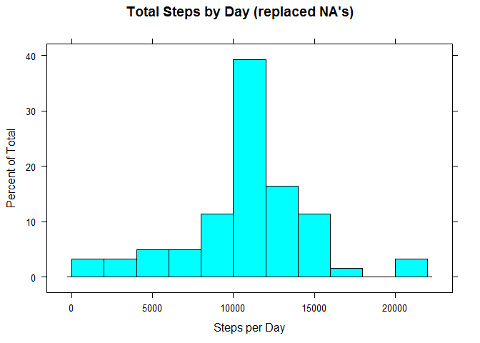

# Reproducible Research: Peer Assessment 1


## Loading and preprocessing the data
Data is unzipped and read to 'act'

```r
unzip("activity.zip")
act <- read.csv("activity.csv", as.is = TRUE)
```

Load necessary libraries

```r
library(lattice)
library(dplyr)
```

```
## 
## Attaching package: 'dplyr'
## 
## The following object is masked from 'package:stats':
## 
##     filter
## 
## The following objects are masked from 'package:base':
## 
##     intersect, setdiff, setequal, union
```

```r
library(ggplot2)
```

## What is mean total number of steps taken per day?

Calculate Total Steps by Day

```r
sums <- as.numeric(sapply(split(act$steps, act$date), sum))
```

Histogram of Total Steps by Day

```r
histogram(sums[!is.na(sums)], breaks = 12, main = "Total Steps by Day",xlab = "Steps per Day")
```

 

Mean of Total Steps by Day

```r
mean(sums, na.rm = TRUE)
```

```
## [1] 10766.19
```
Median of Total Steps by Day

```r
median(sums, na.rm = TRUE)
```

```
## [1] 10765
```

## What is the average daily activity pattern?

Finds the average step count per interval over all days and displays as line plot

```r
steps <- sapply(split(act$steps, act$interval), mean, na.rm = TRUE)
steps<-data.frame(unique(act$interval), steps)
colnames(steps) <- c("interval", "steps")
ggplot(steps, aes(x = interval, y = steps), "l", xlab = "interval")+geom_line()
```

 

Finds the maximum average step count

```r
stepsmax <- max(steps$steps)
steps$interval[grep(stepsmax, steps$steps)]
```

```
## [1] 835
```

## Inputing missing values

Finds total NA's in steps column

```r
sum(is.na(act$steps))
```

```
## [1] 2304
```

Replaces NA's with average steps per interval

```r
actfill <- act
for (i in 1:(dim(actfill)[1]) - 1){
        if (is.na(actfill[i+1,1])){
                actfill[i+1,1] <- as.numeric(steps[(i%%288)+1, 2])}}
```

Finds total steps by day

```r
sumsfill <- as.numeric(sapply(split(actfill$steps, actfill$date), sum))
```

Makes histogram of total steps by day

```r
histogram(sumsfill[!is.na(sumsfill)], 
          breaks = 12, 
          main = "Total Steps by Day (replaced NA's)",
          xlab = "Steps per Day")
```

 

Mean of total steps by day

```r
mean(sumsfill, na.rm = TRUE)
```

```
## [1] 10766.19
```

Median of total steps by day

```r
median(sumsfill, na.rm = TRUE)
```

```
## [1] 10766.19
```

## Are there differences in activity patterns between weekdays and weekends?

Take date and make 'day' column for day of the week

```r
actfill <- mutate(actfill, day = weekdays(as.Date(actfill$date)))
```

Makes column of factors for 'weekday' or 'weekend'

```r
w <- vector()
for (i in 1:dim(actfill)[1]) {
        if (actfill[i,4] == "Sunday" | actfill[i,4] == "Saturday") {
                w <- c(w, "weekend")
        }
        else {w <- c(w, "weekday")}
}
actfill <- mutate(actfill, week = as.factor(w))
```

Finds mean by interval, split by 'weekend' or 'weekday'

```r
w <- vector()
for (i in 1:dim(actfill)[1]) {
        if (actfill[i,4] == "Sunday" | actfill[i,4] == "Saturday") {
                w <- c(w, "weekend")
        }
        else {w <- c(w, "weekday")}
}
actfill <- mutate(actfill, week = as.factor(w))

wendavg<-as.numeric(with(subset(actfill, week == "weekend"), 
                         lapply(split(steps, interval), mean)))
wdayavg<-as.numeric(with(subset(actfill, week == "weekday"), 
                         lapply(split(steps, interval), mean)))

wend<-data.frame(rep(1,288))
wend$steps<-wendavg
wend$interval<-unique(actfill$interval)
wend$week<-as.factor("weekend")
wend<-wend[,2:4]
wday<-data.frame(rep(1,288))
wday$steps<-wdayavg
wday$interval<-unique(actfill$interval)
wday$week<-as.factor("weekday")
wday<-wday[,2:4]
week<-rbind(wday,wend)
```

Plots timeplot for average steps per interval, grouped by 'weekend' or 'weekday'

```r
xyplot(steps ~ interval | week, week, type = "l", layout = c(1,2))
```

 
